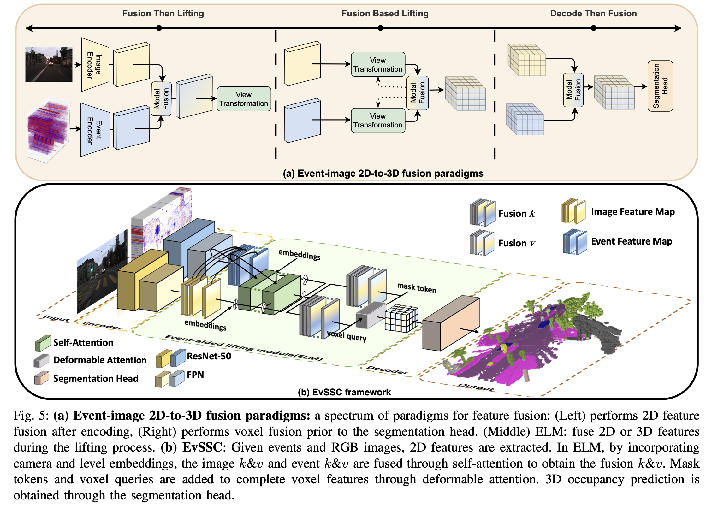

<p align="center">

  <h1 align="center">EvSSC: Event-aided Semantic Scene Completion</h1>
  <h3 align="center">ICASSP 2026</h3>
  <p align="center">
    <a href=""><strong>Shangwei Guo</strong></a>
    ·
    <a href="https://scholar.google.com/citations?hl=zh-CN&user=0EI9msQAAAAJ"><strong>Hao Shi</strong></a>
    ·
    <a href=""><strong>Song Wang</strong></a>
    ·
    <a href="https://www.researchgate.net/profile/Yin-Xiaoting"><strong>Xiaoting Yin</strong></a>
    ·
    <a href="https://scholar.google.com/citations?hl=zh-CN&user=pKFqWhgAAAAJ"><strong>Kailun Yang</strong></a>
    ·
    <a href="https://scholar.google.com/citations?hl=zh-CN&user=B6xWNvgAAAAJ"><strong>Kaiwei Wang</strong></a>
</p>


<p align="center">
    <a href="https://pytorch.org/get-started/locally/"></a>
    <br>
    <a href="https://arxiv.org/pdf/2502.02334">
      
    </a>
</p>

<h2 align="center"></h2>
  <div align="center">
    
  </div>


## 📺Qualitative Results
  
https://www.youtube.com/watch?v=C_8RtiH_HO0

## 🔨Installation (One‑click script)

We provide a bash script that sets up the complete environment including conda, PyTorch, mmcv‑full, mmdetection3d, and the deformable attention operators.

### Prerequisites

- Linux OS (tested on Ubuntu 20.04)
- NVIDIA GPU with **CUDA 11.1** and **cuDNN ≥ 8**
- Conda (Miniconda or Anaconda)

### Steps

   ```bash
   chmod +x install_env.sh
   ./install_env.sh
   ``` 
## ⏬Downloads

📥 **SemanticKITTI-E** – [Download](https://pan.baidu.com/s/1zKM5gKwoZo2lvuM6DN6qlg?pwd=1234)

📥 **DSEC-SSC** – [Download](https://pan.baidu.com/s/14ocybsRbkKDlLZg7jdDGtg?pwd=A93h)

## 💻Train
Train EvSSC with with 4 GPUs

   ```
./tools/dist_train.sh ./projects/configs/voxformer/voxformer_mm-S_3D_event_ELM.py.py 4
   ```

## ⭕️TODO

- [x] Release the code.
- [x] Release the [arXiv preprint](https://arxiv.org/pdf/2502.02334).
- [x] Release datasets.

## ☺️Acknowledgments

We thank the authors of the following open-source projects and datasets for their valuable contributions:

- **VoxFormer** – Sparse voxel transformer for camera-based 3D semantic scene completion.
- **DSEC** – Stereo event camera dataset for driving scenarios.
- **SemanticKITTI** – Large-scale LiDAR dataset for semantic scene understanding.

If you use these resources in your research, please consider citing them using the BibTeX entries below:

```bibtex
@InProceedings{Li_2023_CVPR,
    title     = {VoxFormer: Sparse Voxel Transformer for Camera-Based 3D Semantic Scene Completion},
    author    = {Li, Yiming and Yu, Zhiding and Choy, Christopher and Xiao, Chaowei and Alvarez, Jose M. and Fidler, Sanja and Feng, Chen and Anandkumar, Anima},
    booktitle = {Proceedings of the IEEE/CVF Conference on Computer Vision and Pattern Recognition (CVPR)},
    month     = {June},
    year      = {2023},
    pages     = {9087-9098}
}

@article{dsec2021,
      title={DSEC: A Stereo Event Camera Dataset for Driving Scenarios},
      author={Gehrig, Mathias and Aarents, Willem and Gehrig, Daniel and Scaramuzza, Davide},
      journal={IEEE Robotics and Automation Letters},
      volume={6},
      number={3},
      pages={4947--4954},
      year={2021},
      publisher={IEEE}
}

@inproceedings{semantickitti2019,
      title={SemanticKITTI: A Dataset for Semantic Scene Understanding of LiDAR Sequences},
      author={Behley, Jens and Garbade, Martin and Milioto, Andres and Quenzel, Jan and Behnke, Sven and Stachniss, Cyrill and Gall, Juergen},
      booktitle={Proceedings of the IEEE/CVF International Conference on Computer Vision},
      pages={9297--9307},
      year={2019}
}
```
## 😄Citation

If our work is helpful to you, please consider citing us using the following BibTeX entry:

```bibtex
@inproceedings{guo2026evssc,
      title={Event-aided Semantic Scene Completion}, 
      author={Shangwei Guo and Hao Shi and Song Wang and Xiaoting Yin and Kailun Yang and Kaiwei Wang},
      booktitle={2026 IEEE International Conference on Acoustics, Speech and Signal Processing (ICASSP)},
      year={2026}
}
```
