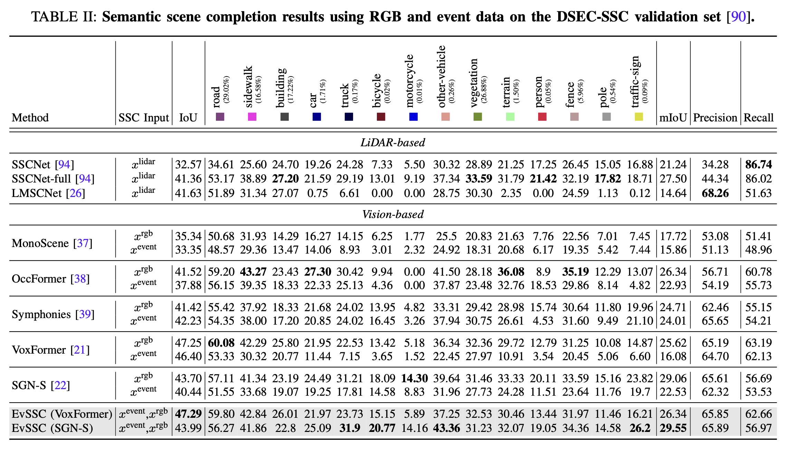

<p align="center">

  <h1 align="center">EvSSC:Event-aided Semantic Scene Completion</h1>
  <p align="center">
    <a href=""><strong>Shangwei Guo</strong></a>
    ·
    <a href="https://scholar.google.com/citations?hl=zh-CN&user=0EI9msQAAAAJ"><strong>Hao Shi</strong></a>
    ·
    <a href=""><strong>Song Wang</strong></a>
    ·
    <a href="https://www.researchgate.net/profile/Yin-Xiaoting"><strong>Xiaoting Yin</strong></a>
    ·
    <a href="https://scholar.google.com/citations?hl=zh-CN&user=pKFqWhgAAAAJ"><strong>Kailun Yang</strong></a>
    ·
    <a href="https://scholar.google.com/citations?hl=zh-CN&user=B6xWNvgAAAAJ"><strong>Kaiwei Wang</strong></a>
</p>


<p align="center">
    <a href="https://pytorch.org/get-started/locally/"></a>
    <br>
    <a href="https://arxiv.org/pdf/2502.02334">
      
    </a>
</p>

<h2 align="center"></h2>
  <div align="center">
    
  </div>

Recent advances in Semantic Scene Completion (SSC) for autonomous driving underscore the limitations of RGB-based approaches, which struggle under motion blur, poor lighting, and adverse weather. Event cameras, offering high dynamic range and low latency, address these challenges by providing asynchronous data that complements RGB inputs. We present **DSEC-SSC**, the first real-world benchmark specifically designed for event-aided SSC, which includes a novel 4D labeling pipeline for generating dense, visibility-aware labels that adapt dynamically to object motion. Our proposed RGB-Event fusion framework, **EvSSC**, introduces an Event-aided Lifting Module (ELM) that effectively bridges 2D RGB-Event features to 3D space, enhancing view transformation and the robustness of 3D volume construction across SSC models. Extensive experiments on DSEC-SSC and simulated SemanticKITTI-E demonstrate that EvSSC is adaptable to both transformer-based and LSS-based SSC architectures. Notably, evaluations on SemanticKITTI-C demonstrate that EvSSC achieves consistently improved prediction accuracy across five degradation modes and both In-domain and Out-of-domain settings, achieving up to a 52.5\% relative improvement in mIoU when the image sensor partially fails. Additionally, we quantitatively and qualitatively validate the superiority of EvSSC under motion blur and extreme weather conditions, where autonomous driving is challenged. 

# Qualitative Results

# Quantitative Results
<h2 align="center"></h2>
  <div align="center">
    
  </div>

# TODO
- [ ] Release the code.
- [x] Release the [arxiv preprint](https://arxiv.org/pdf/2502.02334).

<br>

# Citation
If our work is helpful to you, please consider citing us by using the following BibTeX entry:
```
@misc{guo2025eventaidedsemanticscenecompletion,
      title={Event-aided Semantic Scene Completion}, 
      author={Shangwei Guo and Hao Shi and Song Wang and Xiaoting Yin and Kailun Yang and Kaiwei Wang},
      year={2025},
      eprint={2502.02334},
      archivePrefix={arXiv},
      primaryClass={cs.CV},
      url={https://arxiv.org/abs/2502.02334}, 
}
```
